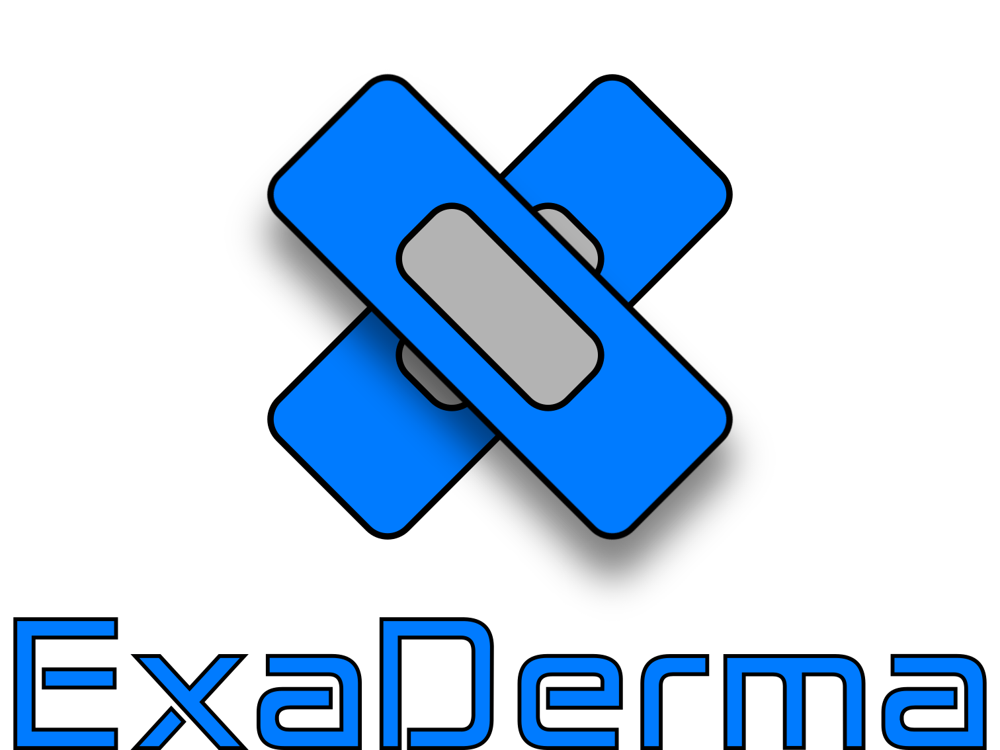

# Exaderma - A Twitter-Like Demo App

Exaderma is a simple Twitter-like demo application built using React Native and Expo. This application is created to showcase basic functionalities and user interface elements resembling the popular social media platform, Twitter.

## Features

- **Tweeting:** Post tweets with your thoughts and ideas.
- **User Timeline:** View your tweets and those of other users.
- **Interaction:** Like tweets with others.
- **Navigation:** Simple and intuitive bottom navigation for easy page switching.

## Getting Started

To run the Exaderma demo app on your local machine, follow these steps:

1. Make sure you have Node.js and Expo CLI installed. If not, you can install them from [Node.js](https://nodejs.org/) and [Expo CLI](https://expo.dev/).

2. Clone the Exaderma repository to your local machine:
git clone https://github.com/Laurea-University-Mobile-App-Dev/DemoApp.git

3. Install the project dependencies:
npx expo install

4. Start the development server:
npx expo start

5. Use your preferred mobile device or emulator to scan the QR code generated by Expo Go app or run it on a specific platform:
- For Android, use the Expo Go app.
- For iOS, use the Camera app or Expo Go.

6. The Exaderma app will load on your mobile device, and you can start exploring its features.

## Project Structure

The project structure is organized as follows:

- `src/`: Contains the main source code of the Exaderma app.
- `assets/`: Contains static assets like images and fonts.
- `components/`: Contains reusable React components.
- `navigation.js`: Defines the app's navigation structure.
- `screens/`: Defines the various app screens, such as the home screen and profile screen.

## Contributing

If you would like to contribute to this project or have suggestions, feel free to open an issue or create a pull request.

## License

This project is licensed under the MIT License. See the [LICENSE](LICENSE) file for more details.

If there is a problem, contact me.

